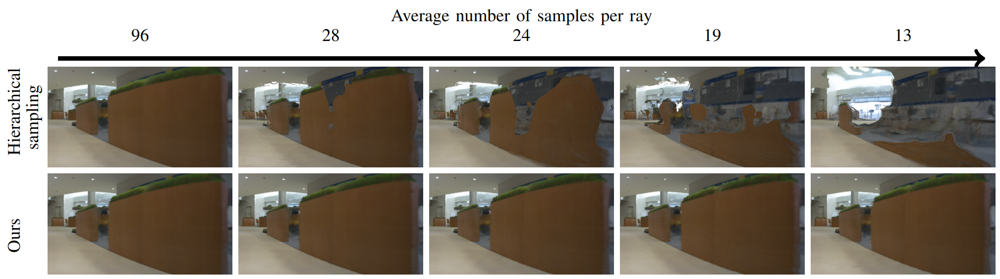
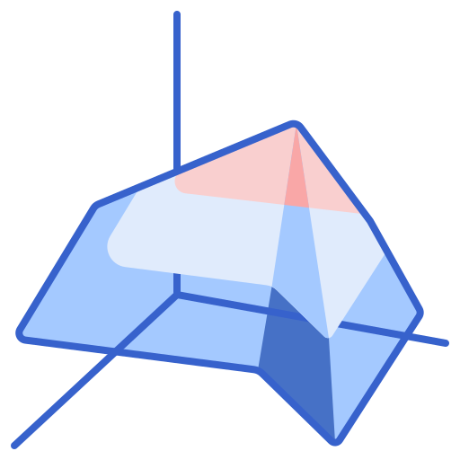
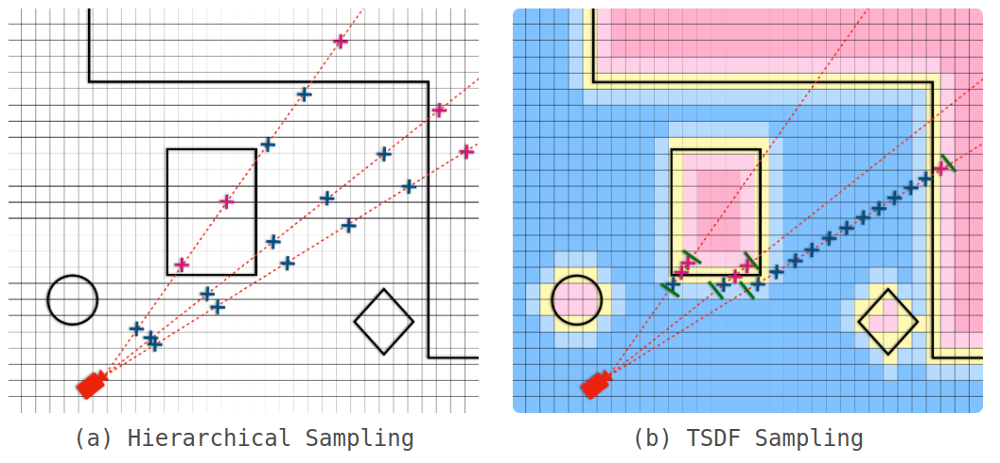

# TSDF-Sampling
> __Fast Spatial Reasoning of Implicit 3D maps through Explicit Near-Far Sampling Range Prediction__  
> Chaerin Min*, Sehyun Cha*, Changhee Won, Jongwoo Lim+ \
> (* equal contribution, + corresponding author) \
> _IEEE/RSJ International Conference on Intelligent Robots and Systems. (IROS), 2024._  
> __[Paper](https://arxiv.org/abs/2311.17878) &nbsp; [Project](https://chaerinmin.github.io/TSDF-sampling/)__

 

# 💡Note
- **Replica dataset + Vanilla NeRF backbone**: available in this repo!
- **Lobby/Garage dataset + MonoSDF backbone**: code and datasets are ready for reproducing, but they are under the license of [MultiplEYE Co.](https://multipleye.co/en/) Ask MultiplEYE directly, if you want them!
- If anything doesn't work, feel free to leave an issue 🙏
# Installation 

This code was tested at `Ubuntu 22.04`, `NVIDIA RTX 3090`, `cuda 11.7`, and `gcc 10.5.0`.

```sh
conda create -n tsdf_sampling python=3.7.16
conda activate tsdf_sampling
pip install torch==1.13.1+cu117 torchvision==0.14.1+cu117 torchaudio==0.13.1 --extra-index-url https://download.pytorch.org/whl/cu117
pip install -r requirements.txt  

cd extensions
pip install ./hashencoder
pip install ./raymarching
pip install git+https://github.com/NVlabs/tiny-cuda-nn/#subdirectory=bindings/torch
```

# Dataset
We use the preprocessed [Replica](https://github.com/facebookresearch/Replica-Dataset) dataset by [MonoSDF](https://github.com/autonomousvision/monosdf). You can download it easily with follows:
```sh
wget https://s3.eu-central-1.amazonaws.com/avg-projects/monosdf/data/Replica.tar
```
Unzip it and put them under `datasets/replica`. The file structure should look like:
```
TSDF-sampling
|--datasets
|   |--replica
|   |   |--scan1
|   |   |-- ...
|--train.py
|-- ...
```

# Train

Pretrained NeRF model is available at [https://drive.google.com/file/d/1dq2C-B2UNcvxeYlQEjzpLBL3kh9ginTU/view?usp=sharing](https://drive.google.com/file/d/1dq2C-B2UNcvxeYlQEjzpLBL3kh9ginTU/view?usp=sharing). Unzip and place it under `outputs/`. The file structure should look like:
```
TSDF-sampling
|--outputs
|   |--base_sampler_train_view_050000
|   |   |-- ...
|   |--050000.pt
|   |--config.gin 
|   |-- ...
|--train.py
|-- ...
```

If you need to train the NeRF by yourself, run the following (takes ~5 hr):

```sh
bash ./scripts/vanilla_nerf.sh
```

#  Create TSDF



We need to save depth maps from the NeRF to start making TSDF. This takes some moments. But if you have downloaded the pretrained NeRF model, the depth maps should already be in `outputs` for your convenience.

The following code tries making the TSDF volume from the depth maps and tests the accuracy of the volume. 

```sh
bash evalute_tsdf.sh
```

# Render

NOTE: Rendering was tested in either a5000 or a6000. For smaller vrams, maybe you could try smaller `nb_margin` or smaller `max_walk_step` in `configs/test_ours.gin,` with trade-offs with marginal performance drop.

```sh
CUDA_VISIBLE_DEVICES=0 python -m test --gin_configs=configs/test_ours.gin
```
You may want to tweak some parameters in the .gin files. The explanation of parameters are provided in the class definitions of `nerf_components/sampler.py`.

For comparison with NeRF w/o TSDF, 

```sh
CUDA_VISIBLE_DEVICES=0 python -m test --gin_configs=configs/test_hierarchical.gin
```

# Make Novel View Video

```sh
bash render_video.sh
```

# Acknowledgements
This work was partly supported by Institute of Information \& communications Technology Planning \& Evaluation (IITP) grant funded by the Korea government(MSIT) [NO.RS-2021-II211343, Artificial Intelligence Graduate School Program (Seoul National University)] and the Technology Innovation Program (No. 20018110,
"Development of a wireless tele-operable relief robot for detecting searching and responding in narrow space") funded by the Ministry of Trade, Industry \& Energy (MOTIE, Korea).

## Related Resources

Project page template was borrowed from [Nerfies](https://nerfies.github.io/).

# Citations

    @article{min2023tsdf,
      title={TSDF-Sampling: Efficient Sampling for Neural Surface Field using Truncated Signed Distance Field},
      author={Min, Chaerin and Cha, Sehyun and Won, Changhee and Lim, Jongwoo},
      journal={arXiv preprint arXiv:2311.17878},
      year={2023}
    }
